# Project Babis: Autonomous Edge AI & Voice Interaction for Unitree G1

Το "Project Babis" αποτελεί ένα ολοκληρωμένο, αυτόνομο σύστημα οπτικοακουστικής αλληλεπίδρασης (Edge AI) για το ερευνητικό ανθρωποειδές ρομπότ Unitree G1 EDU. Το σύστημα αναπτύχθηκε στο **Sense Lab (Πολυτεχνείο Κρήτης)** και είναι ειδικά βελτιστοποιημένο για φυσική επικοινωνία στην Ελληνική γλώσσα.

Επιτρέπει στο ρομπότ να ανιχνεύει ανθρώπινη παρουσία μέσω κάμερας (YOLOv8), να μετατρέπει την ομιλία σε κείμενο (STT), να παράγει απαντήσεις με φυσική γλώσσα (LLM) και να εκφωνεί το αποτέλεσμα (TTS). Ολόκληρο το σύστημα εκτελείται on-board (εγγενώς) στον υπολογιστή τεχνητής νοημοσύνης του ρομπότ (Jetson Orin).

```mermaid
graph TD
    %% Input Sources
    subgraph Inputs ["Αισθητήρες (Inputs)"]
        Camera["Κάμερα"]
        Mic["Μικρόφωνο"]
    end

    %% Processing & Edge AI
    subgraph EdgeAI ["On-Board Edge AI (Jetson Orin)"]
        Yolo["YOLOv8"]
        VisionFSM["Vision FSM"]
        StT["Speech-to-Text"]
        Brain["Κεντρικός Εγκέφαλος"]
    end

    %% Cloud / External AI
    subgraph Cloud ["Cloud Services"]
        Gemini["Gemini 1.5 Flash API"]
    end

    %% Outputs & Actuators
    subgraph Outputs ["Hardware & Outputs"]
        TTS["Edge-TTS"]
        Speaker["Ηχείο G1"]
        Hardware["Unitree G1 Hardware (LED & Κίνηση)"]
    end

    %% Connections
    Camera -->|YOLOv8| VisionFSM
    Mic -->|g1_mic| StT
    
    VisionFSM -->|Άνθρωπος Εντοπίστηκε| Brain
    StT -->|Ηχητικό Κείμενο| Brain

    Brain -->|SDK2| Hardware
    Brain -->|System Prompt| Gemini
    
    Gemini -->|Απάντηση| TTS
    TTS -->|g1_speaker| Speaker

    %% Styling
    style Brain fill:#333,stroke:#fff,stroke-width:2px;
    style Gemini fill:#d86b00,stroke:#fff,stroke-width:1px;
    style EdgeAI fill:#1e1e1e,stroke:#555,stroke-width:1px;
```



---

## ⚙️ Ροή Λειτουργίας & Αλληλεπίδραση (System Operation)

Το σύστημα βασίζεται σε μια Μηχανή Πεπερασμένων Καταστάσεων (Finite State Machine - FSM) που διαχειρίζεται τη συμπεριφορά του ρομπότ, τα όρια συζήτησης και την οπτική ανατροφοδότηση μέσω των LED του προσώπου. 

### 1. Οπτική Ανατροφοδότηση (LED States)
Η κατάσταση του ρομπότ υποδεικνύεται ανά πάσα στιγμή από το χρώμα των LED:
*   🔵 **Μπλε (Standby):** Το ρομπότ βρίσκεται σε κατάσταση αναμονής. Περιμένει είτε να ανιχνεύσει άνθρωπο μέσω της κάμερας, είτε να ακούσει το Wake Word.
*   🟢 **Πράσινο (Auto Mode / Listening):** Το μικρόφωνο είναι ενεργό και το ρομπότ καταγράφει την ομιλία του χρήστη.
*   🟣 **Μωβ (Processing / Speaking):** Το σύστημα επεξεργάζεται το ηχητικό σήμα, επικοινωνεί με το LLM ή εκφωνεί την απάντηση.

### 2. Ανίχνευση & Έναρξη Συζήτησης
Όταν το μοντέλο YOLOv8 εντοπίσει άνθρωπο σε κοντινή απόσταση, το ρομπότ πραγματοποιεί τον αρχικό χαιρετισμό εκφωνώντας ένα προκαθορισμένο μήνυμα, ενώ παράλληλα σηκώνει το χέρι του ("high wave"). Μετά τον χαιρετισμό, τα LED γίνονται πράσινα και το ρομπότ εισέρχεται σε "Auto Mode", περιμένοντας την πρώτη ερώτηση.

### 3. Όρια Διαλόγου & Timeout
Για την αποφυγή συνεχούς και άσκοπης καταγραφής θορύβου, έχουν τεθεί συγκεκριμένοι περιορισμοί:
*   **Όριο Ερωτήσεων:** Σε κατάσταση Auto Mode, ο χρήστης μπορεί να κάνει έως και **6 συνεχόμενες ερωτήσεις** (`MAX_CONSECUTIVE_AUTO_QUESTIONS`). Μετά την 6η απάντηση, το ρομπότ επιστρέφει σε κατάσταση Standby (Μπλε LED).
*   **Timeout Αδράνειας:** Εάν το ρομπότ βρίσκεται σε Auto Mode αλλά δεν εντοπίσει ομιλία για **12 δευτερόλεπτα** (`AUTO_QUESTION_TIMEOUT`), το σύστημα μεταπίπτει σε κατάσταση Standby.

### 4. Λειτουργία Wake Word
Όταν το ρομπότ βρίσκεται σε κατάσταση Standby (Μπλε), ο χρήστης μπορεί να επανεκκινήσει τη συζήτηση προφέροντας το Wake Word. Το σύστημα αναγνωρίζει λέξεις-κλειδιά ("μπαμπ", "Μπάμπη", "Babi") και παραφθορές αυτών. Εφόσον το Wake Word αναγνωριστεί, τα LED γίνονται πράσινα και το ρομπότ περιμένει την ερώτηση.

### 5. Ολική Επαναφορά (Absence Reset)
Εάν δεν ανιχνευθεί άνθρωπος στο οπτικό πεδίο της κάμερας για 15 συνεχόμενα δευτερόλεπτα (`reset_timeout`), το σύστημα κάνει reset το state (`has_greeted = False`) και επιστρέφει σε αρχική κατάσταση, έτοιμο να χαιρετήσει τον επόμενο χρήστη που θα πλησιάσει.

---

## 🏗️ Εξέλιξη Αρχιτεκτονικής (Architecture Evolution)

Η ανάπτυξη του συστήματος πραγματοποιήθηκε σε δύο διακριτές φάσεις:

*   **Φάση 1: Κατανεμημένο Σύστημα (Windows & Linux μέσω UDP)**
    Η αρχική υλοποίηση βασίστηκε σε διαχωρισμό του υπολογιστικού φόρτου. Η λογική επεξεργασία (STT, LLM, TTS) εκτελούνταν σε εξωτερικό σταθμό εργασίας (Windows PC), ενώ το Jetson Orin του ρομπότ (Linux) διαχειριζόταν αποκλειστικά την όραση υπολογιστή (YOLO) και τον έλεγχο υλικού (Unitree SDK). Η επικοινωνία πραγματοποιούνταν μέσω δικτυακών πακέτων UDP. Αυτή η προσέγγιση απορρίφθηκε, διότι η δικτυακή εξάρτηση εισήγαγε καθυστερήσεις (network latency), απώλεια πακέτων και ακύρωνε την πλήρη αυτονομία του ρομπότ.
*   **Φάση 2: Πλήρως On-Board Edge AI (Τελική Υλοποίηση)**
    Με γνώμονα την εξάλειψη των καθυστερήσεων, ολόκληρο το software pipeline ενοποιήθηκε και μεταφέρθηκε (ported) ώστε να εκτελείται εγγενώς στο Ubuntu περιβάλλον του Nvidia Jetson. Το ρομπότ λειτουργεί πλέον ως πλήρως ανεξάρτητη υπολογιστική μονάδα.

---

## 🔬 Έρευνα & Ανάπτυξη (Tech Stack & R&D)

Η ανάπτυξη εστίασε στη χρήση εργαλείων μηδενικού λειτουργικού κόστους (Zero-Cost Strategy), απορρίπτοντας τοπικά μοντέλα (όπως Ollama/Llama 3 και Whisper) λόγω των υψηλών απαιτήσεων σε πόρους που προκαλούσαν καθυστερήσεις άνω των 4 δευτερολέπτων (time-to-first-token) και θερμικό throttling στο Jetson.

Το τελικό βελτιστοποιημένο Tech Stack διαμορφώθηκε ως εξής:
*   **Όραση (Vision):** `ultralytics` (YOLOv8-nano) για real-time ανίχνευση ανθρώπου (inference time < 30ms).
*   **Αναγνώριση Ομιλίας (STT):** Βιβλιοθήκη `SpeechRecognition` με χρήση του Google API για ακαριαία μεταγραφή.
*   **Παραγωγή Λόγου (LLM):** Google Gemini 1.5 Flash μέσω API (Free-Tier). Έχει ρυθμιστεί με Custom System Prompt, αναλαμβάνοντας την περσόνα του εργαστηρίου.
*   **Σύνθεση Φωνής (TTS):** Μηχανή `edge-tts` (Microsoft Edge Text-to-Speech) για φυσική απόδοση στα Ελληνικά (`el-GR-NestorasNeural`), απορρίπτοντας λύσεις όπως το Piper TTS λόγω έντονης μηχανικής χροιάς.
*   **Έλεγχος Υλικού (Hardware Control):** Επίσημο `unitree_sdk2py` για τον έλεγχο των βραχιόνων και των LED.

---

## 🛠️ Τεχνικές Προκλήσεις & Επιλύσεις

Η υλοποίηση του συστήματος απαίτησε την επίλυση σειράς προβλημάτων σε επίπεδο λειτουργικού συστήματος (Linux System Engineering) και επεξεργασίας φυσικής γλώσσας (NLP):

1.  **Περιορισμοί Ελληνικής Γλώσσας (NLP Limitations):** 
    Τα συστήματα STT και TTS παρουσίαζαν αδυναμίες στην ορθή προφορά αγγλικών ακρωνυμίων. Η επίλυση επιτεύχθηκε μέσω αυστηρού Prompt Engineering. Στο System Prompt δόθηκε ρητή εντολή στο LLM να αποδίδει κάθε ξενόγλωσσο όρο αποκλειστικά φωνητικά με ελληνικούς χαρακτήρες (π.χ. "Σενς Λαμπ", "Έρμπας"). 
2.  **Διαχείριση Δρομολόγησης Ήχου (PulseAudio Routing):** 
    Η αρχιτεκτονική του ρομπότ διαχωρίζει το υλικό ήχου (ηχείο/μικρόφωνα στο PC1) από τη μονάδα επεξεργασίας (Jetson στο PC2). Χρησιμοποιήθηκε ένα custom bridge (G1 Audio Driver) που γεφυρώνει τα PCs μέσω Multicast UDP και DDS PlayStream RPC, δημιουργώντας τις εικονικές συσκευές `g1_microphone` και `g1_speaker`. Για την αποφυγή λανθασμένης δρομολόγησης, προστέθηκαν εντολές συστήματος (`pactl set-default-sink/source`) εντός του κώδικα Python και χρησιμοποιήθηκε η μεταβλητή `PULSE_SINK` στο subprocess του `ffplay`. Ο ήχος χρησιμοποιεί αυστηρά το format `s16le` (16,000 Hz, 1 κανάλι, 16-bit).
3.  **Διαχείριση Σφαλμάτων ALSA (Error Suppression):** 
    Κατά την προετοιμασία των ροών ήχου, η βιβλιοθήκη `PyAudio` παρήγαγε συνεχή μηνύματα σφάλματος (`snd_pcm_open_noupdate`) στο standard output. Η αντιμετώπιση έγινε με τη δημιουργία ενός null error handler σε γλώσσα C, ο οποίος φορτώθηκε μέσω της βιβλιοθήκης `ctypes`, καταστέλλοντας τις προειδοποιήσεις σε επίπεδο μνήμης.
4.  **Κλείδωμα Μικροφώνου (Hardware Privacy):** 
    Το μικρόφωνο του ρομπότ παραμένει απενεργοποιημένο από το εργοστασιακό υλικολογισμικό. Απαιτείται η ρητή ενεργοποίηση του "Voice Assistant" μέσω της επίσημης εφαρμογής της Unitree για την εκκίνηση της ροής δεδομένων (αλλάζοντας το mode μέσω του API 1008).
5.  **Σταθεροποίηση Οπτικής Ένδειξης (LED Keep-Alive):** 
    Το εσωτερικό δίκτυο DDS του ρομπότ επαναφέρει αυτόματα τα LED στο προεπιλεγμένο λευκό χρώμα. Για την επιβολή του δικού μας οπτικού UI, υλοποιήθηκε ένα ανεξάρτητο νήμα (thread) με μηχανισμό `threading.Lock()`, το οποίο αποστέλλει το επιθυμητό χρώμα στο SDK ανά 0,5 δευτερόλεπτα, εξασφαλίζοντας σταθερότητα.

---

## 📂 Δομή Κώδικα
*   `config.py`: Αρχείο παραμετροποίησης, κωδικών API, ορισμού δικτυακών διεπαφών και του System Prompt.
*   `llm.py`: Ασύγχρονη διαχείριση API calls προς το Gemini μέσω `ThreadPoolExecutor` και fallback απαντήσεων.
*   `robot_control.py`: Αρχικοποίηση Unitree SDK, έλεγχος LED, λειτουργία κίνησης χεριών και αναπαραγωγή ήχου.
*   `main.py`: Ο κεντρικός βρόχος ελέγχου (FSM). Συντονίζει την όραση (OpenCV/YOLOv8), την καταγραφή ήχου, τα νήματα ελέγχου και τις μεταβάσεις καταστάσεων.

---

## 🚀 Πλήρης Οδηγός Εγκατάστασης

> ⚠️ **ΣΗΜΑΝΤΙΚΗ ΕΠΙΣΗΜΑΝΣΗ:** Εφόσον το σύστημα λειτουργεί 100% on-board, **όλες οι παρακάτω εντολές (Βήματα 2-6) πρέπει να εκτελεστούν αποκλειστικά εντός του τερματικού του ρομπότ (Jetson)** μέσω SSH.

### Βήμα 1: Αρχική Σύνδεση & Ρύθμιση Wi-Fi
1. Συνδέστε το ρομπότ στο τοπικό δίκτυο Wi-Fi μέσω της εφαρμογής **Unitree Explore**.
2. Συνδέστε το PC σας στο ρομπότ με καλώδιο Ethernet.
3. Ανοίξτε SSH τερματικό προς την εργοστασιακή IP του Jetson: `ssh unitree@192.168.123.164` (Κωδικός: `123`).
4. Εκτελέστε την εντολή `ip a`, εντοπίστε την ασύρματη διεπαφή (`wlan0`) και σημειώστε τη διεύθυνση IP.
5. Αφαιρέστε το καλώδιο Ethernet και επανασυνδεθείτε μέσω SSH στη νέα ασύρματη IP.

### Βήμα 2: Εγκατάσταση G1 Audio Driver (Μέσα στο Ρομπότ)
Απαιτείται ο εγκαταστάτης του custom οδηγού ήχου (PulseAudio bridge) για τη δρομολόγηση των μικροφώνων και του ηχείου.
```bash
git clone [https://github.com/experientialtech/g1-audio-driver.git](https://github.com/experientialtech/g1-audio-driver.git) ~/g1-audio-driver
cd ~/g1-audio-driver
./install.sh --start
```
*(Απαιτείται η ενεργοποίηση Multicast στο τοπικό δίκτυο της θύρας `eth0` στο υποδίκτυο `192.168.123.0/24`, καθώς ο οδηγός λαμβάνει δεδομένα UDP στη διεύθυνση `239.168.123.161:5555`).*

### Βήμα 3: Εγκατάσταση Unitree SDK2 (Μέσα στο Ρομπότ)
1. Κατεβάστε το `unitree_sdk2_python` από την Unitree στον κατάλογο του Jetson (προεπιλογή: `~/unitree-sdk2-python`).
2. Εγκαταστήστε τη βιβλιοθήκη (`pip3 install -e .`).
3. Βεβαιωθείτε ότι το αρχείο `config.py` έχει ρυθμιστεί στη σωστή διεπαφή επικοινωνίας (π.χ. `eth0`).

### Βήμα 4: Εγκατάσταση Εξαρτήσεων (Μέσα στο Ρομπότ)
Εγκαταστήστε τα απαραίτητα συστημικά πακέτα και τις βιβλιοθήκες Python:
```bash
sudo apt update
sudo apt install ffmpeg pulseaudio alsa-utils
pip install ultralytics speechrecognition pyaudio requests opencv-python edge-tts
```

### Βήμα 5: Παραμετροποίηση & Χειροκίνητη Εκτέλεση
1. Στο αρχείο `config.py`, ορίστε το `ROBOT_NETWORK_INTERFACE` (συνήθως `eth0`) και το `CAMERA_INDEX` (συνήθως `2` ή `0`).
2. Στην εφαρμογή Unitree Explore, ενεργοποιήστε το **"Voice Assistant"**. *(Χωρίς αυτό το βήμα, το hardware μικρόφωνο δεν μεταδίδει δεδομένα)*.
3. Ορίστε το API Key ως μεταβλητή περιβάλλοντος: `export GEMINI_API_KEY="το_κλειδί_σας"`
4. Εκκινήστε το λογισμικό: `python3 main.py`

### Βήμα 6: Εκτέλεση ως Υπηρεσία (Systemd Daemon) - *Προαιρετικό*
Για πλήρη αυτονομία χωρίς ανάγκη SSH, το σύστημα έχει ρυθμιστεί να εκκινείται αυτόματα κατά την εκκίνηση του ρομπότ. Δημιουργήστε ένα user service αρχείο:
```bash
mkdir -p ~/.config/systemd/user/
nano ~/.config/systemd/user/babis.service
```
*(Προσθέστε το απαραίτητο configuration file, ορίζοντας το API Key σας, το `PULSE_RUNTIME_PATH=/run/user/1000/pulse` και το σωστό path του `main.py`)*.

Ενεργοποιήστε την υπηρεσία:
```bash
systemctl --user daemon-reload
systemctl --user enable babis.service
systemctl --user start babis.service
```
Πλέον το ρομπότ είναι πλήρως αυτόνομο και έτοιμο για αλληλεπίδραση μόλις συνδεθεί στο ρεύμα!

---

## 🔮 Μελλοντικές Επεκτάσεις (Future Work)
Η αρχιτεκτονική του κώδικα έχει σχεδιαστεί με γνώμονα την επεκτασιμότητα. Πιθανές μελλοντικές προσθήκες που θα αναβαθμίσουν την αυτονομία του ρομπότ περιλαμβάνουν:

*   **Πολυτροπική Αντίληψη (Multimodal Vision μέσω Gemini):** Αξιοποίηση της ικανότητας του Gemini 1.5 Flash να επεξεργάζεται εικόνα. Αντί να στέλνουμε μόνο κείμενο, το FSM θα μπορεί να κάνει capture ένα frame από την κάμερα τη στιγμή της ερώτησης. Έτσι, το ρομπότ θα μπορεί να απαντά σε ερωτήσεις όπως *"Τι κρατάω στο χέρι μου;"* ή *"Περίγραψε τον χώρο του εργαστηρίου"*.
*   **Δυναμικός Προσανατολισμός Κορμού (Body Tracking):** Εφόσον το κεφάλι του G1 δεν διαθέτει αρθρώσεις Pitch/Yaw, τα δεδομένα του κέντρου βάρους (`x, y`) από τα Bounding Boxes του YOLOv8 μπορούν να τροφοδοτήσουν το SDK της Unitree. Ο αλγόριθμος θα δίνει εντολή περιστροφής στη μέση του ρομπότ (waist yaw joint) ώστε ο κορμός του να "ακολουθεί" και να γυρίζει πάντα προς τον συνομιλητή.
*   **LLM-Driven Gestures & Συναισθηματικά LED:** Επέκταση του System Prompt ώστε το Gemini να επιστρέφει κρυφές ετικέτες διάθεσης (π.χ. `[HAPPY]`, `[THINKING]`, `[SURPRISED]`). Το σύστημα θα κάνει parse αυτές τις ετικέτες πριν την εκφώνηση, πυροδοτώντας αντίστοιχες κινήσεις στα χέρια (μέσω SDK) και αλλάζοντας δυναμικά τα χρώματα/μοτίβα των LED.
*   **Εξατομίκευση & Αναγνώριση Ομιλητή (Speaker Verification):** Ενσωμάτωση ενός ελαφριού νευρωνικού δικτύου (π.χ. SpeechBrain) παράλληλα με το STT, το οποίο θα εξάγει τα βιομετρικά χαρακτηριστικά της φωνής, αναγνωρίζοντας γνωστά μέλη του εργαστηρίου.
*   **Τοπική Μηχανή Wake-Word (Offline AI):** Αντικατάσταση της μεθόδου `recognize_google` (κατά τον έλεγχο του wake-word) με μια εξειδικευμένη, τοπική λύση (π.χ. Picovoice Porcupine). Αυτό θα μηδενίσει το bandwidth σε κατάσταση Standby (Μπλε LED) και θα προσφέρει ακαριαία απόκριση.
