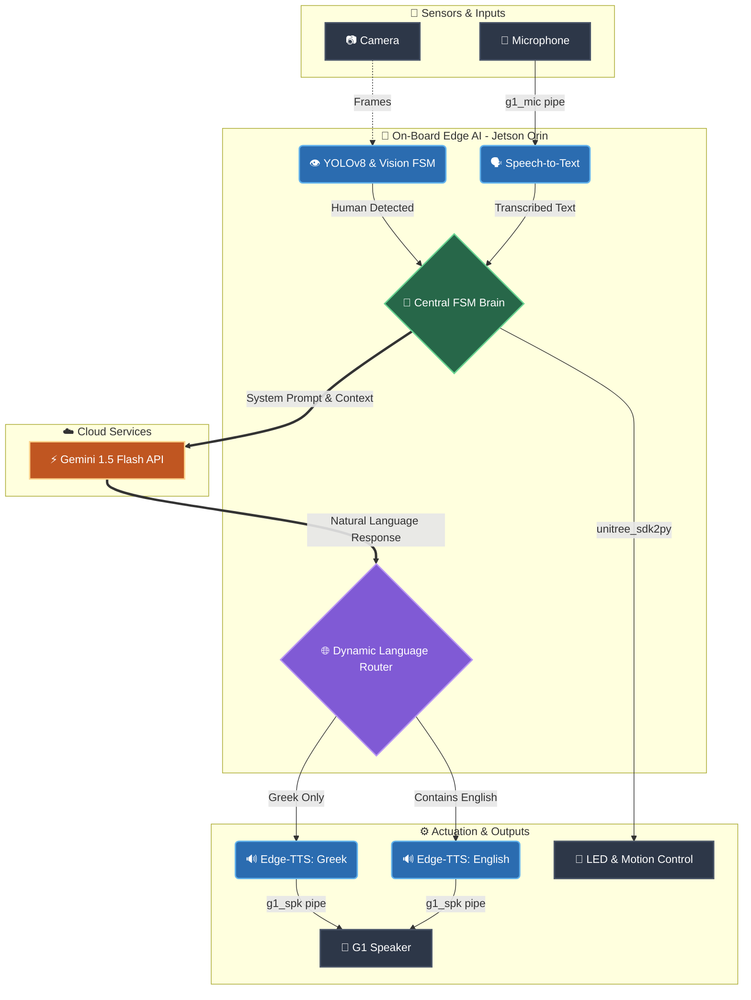

# Project Babis: Autonomous Edge AI & Voice Interaction for Unitree G1

"Project Babis" is a comprehensive, fully autonomous audiovisual interaction (Edge AI) system developed for the **Unitree G1 EDU** research humanoid robot. Created at the **Sense Lab (Technical University of Crete)**, this system transforms the robot into a conversational AI entity capable of fluid, bilingual interaction (Greek & English).

It enables the robot to detect human presence via its onboard camera (YOLOv8), transcribe speech-to-text (STT), generate natural language responses (LLM), and synthesize realistic speech (TTS). The entire software pipeline runs natively (on-board) on the robot's internal AI computer (Nvidia Jetson Orin).



---

## ⚙️ System Operation & Interaction Flow

The system revolves around a Finite State Machine (FSM) that manages the robot's behavior, conversational boundaries, and visual feedback via its facial LEDs.

### 1. Visual Feedback (LED States)
The robot's current state is always indicated by its facial LEDs:
*   🔵 **Blue (Standby):** The robot is idle, waiting either to detect a human via the camera or to hear the predefined Wake Word.
*   🟢 **Green (Auto Mode / Listening):** The microphone is active, and the robot is actively recording the user's speech.
*   🟣 **Purple (Processing / Speaking):** The system is processing audio, communicating with the LLM, or currently speaking the response.

### 2. Detection & Greeting
When the YOLOv8 model detects a person at close range, the robot performs an initial greeting by speaking a predefined phrase while raising its arm ("high wave"). Following the greeting, the LEDs turn green, and the robot enters "Auto Mode," awaiting the user's first question.

### 3. Conversation Limits & Timeout
To prevent endless recording of background noise, specific limits are enforced:
*   **Question Limit:** In Auto Mode, the user can ask up to **6 consecutive questions** (`MAX_CONSECUTIVE_AUTO_QUESTIONS`). After the 6th answer, the robot gracefully returns to Standby (Blue LEDs).
*   **Idle Timeout:** If the robot is in Auto Mode but detects no speech for **12 seconds** (`AUTO_QUESTION_TIMEOUT`), it automatically falls back to Standby.

### 4. Wake Word Activation
While in Standby (Blue), the user can re-initiate a conversation by saying the Wake Word. The system recognizes keywords (e.g., "Babi", "Mpampi") and common variations. Upon recognition, the LEDs turn green, and the robot listens for a query.

### 5. Absence Reset (Global Reset)
If no human is detected in the camera's field of view for 15 consecutive seconds (`reset_timeout`), the system resets its state (`has_greeted = False`). It returns to its initial configuration, ready to greet the next person who approaches.

---

## 🏗️ Architecture Evolution

The system was developed in two distinct phases:

*   **Phase 1: Distributed System (Windows & Linux via UDP)**
    The initial implementation split the computational load. Logic processing (STT, LLM, TTS) ran on an external Windows PC, while the robot's Jetson Orin (Linux) handled computer vision (YOLO) and hardware control (Unitree SDK). This approach was abandoned due to network latency, packet loss, and the loss of true autonomy.
*   **Phase 2: Fully On-Board Edge AI (Final Implementation)**
    To eliminate latency, the entire software pipeline was unified and ported to run natively within the Nvidia Jetson's Ubuntu environment. The robot now operates as a 100% independent edge computing unit.

---

## 🔬 Tech Stack & R&D

Development prioritized a Zero-Cost Strategy, favoring high-speed APIs over local models (like Ollama/Llama 3 or Whisper) which caused unacceptable latency (>4 seconds time-to-first-token) and thermal throttling on the Jetson.

The optimized Tech Stack is as follows:
*   **Vision:** `ultralytics` (YOLOv8-nano) for real-time human detection (inference time < 30ms).
*   **Speech-to-Text (STT):** `SpeechRecognition` library utilizing the Google API for near-instant transcription.
*   **Large Language Model (LLM):** Google Gemini 1.5 Flash via API (Free-Tier), configured with a highly specific Custom System Prompt to adopt the lab's persona.
*   **Text-to-Speech (TTS):** `edge-tts` (Microsoft Edge Neural Voices) for highly realistic phonetic rendering.
*   **Hardware Control:** Official `unitree_sdk2py` for arm articulation and LED manipulation.

---

## 🛠️ Technical Challenges & Solutions

Implementing this pipeline natively on the G1 required solving several Linux System Engineering and NLP challenges:

1.  **Bilingual Support & NLP Routing (Dynamic TTS):** 
    Supporting both Greek and English naturally was a major hurdle. A "Language Router" was developed using Regex to scan the LLM's output for Latin characters. If English text is detected, the system dynamically switches the TTS voice to an American neural profile (`en-US-ChristopherNeural`), otherwise defaulting to Greek (`el-GR-NestorasNeural`). Smart Prompt Engineering ensures the LLM handles mixed-language microphone transcriptions (Greeklish) without crashing the TTS engine.
2.  **Audio Routing (PulseAudio Bridge):** 
    The robot physically separates its audio hardware (PC1) from its AI computer (Jetson on PC2). A custom bridge (G1 Audio Driver) was utilized to bridge the PCs via Multicast UDP and DDS PlayStream RPC, exposing virtual devices `g1_microphone` and `g1_speaker`. Explicit `pactl` commands and `PULSE_SINK` environment variables force all Python subprocesses (`ffplay`) to route audio strictly to the robot's physical hardware.
3.  **ALSA Error Suppression:** 
    During audio stream initialization, `PyAudio` flooded the standard output with C-level ALSA warnings (`snd_pcm_open_noupdate`). This was handled by injecting a custom null error handler in C, loaded via Python's `ctypes` library, suppressing the warnings at the memory level.
4.  **Microphone Privacy Lock:** 
    The factory firmware keeps the microphone physically disabled. It requires explicit activation of the "Voice Assistant" mode via the official Unitree mobile app (API 1008 toggle) before any audio data can be captured via Python.
5.  **LED Keep-Alive Mechanism:** 
    The robot's internal DDS network aggressively attempts to reset the facial LEDs to their default white color. To enforce our custom UI colors (Blue/Green/Purple), a dedicated background thread with a `threading.Lock()` was implemented. This thread continuously broadcasts our desired color to the SDK every 0.5 seconds, safely overriding the firmware's default behavior.

---

## 📂 Code Structure
*   `config.py`: Central configuration, API keys, network interfaces, and the core FSM System Prompt.
*   `llm.py`: Asynchronous API management for Gemini using `ThreadPoolExecutor`, including local cache fallbacks.
*   `robot_control.py`: Hardware abstraction layer (Unitree SDK initialization, LED Keep-Alive thread, motion mapping, and dynamic TTS audio playback).
*   `main.py`: The central brain. Coordinates OpenCV/YOLOv8 vision, audio capture, state transitions, and background execution threads.

---

## 🚀 Installation & Deployment Guide

> ⚠️ **IMPORTANT:** Since the system is 100% on-board, **Steps 2 through 6 must be executed directly within the robot's terminal (Jetson Orin)** via SSH.

### Step 1: Initial Network Setup
1. Connect the robot to your local Wi-Fi via the **Unitree Explore** mobile app.
2. Connect your PC to the robot using an Ethernet cable.
3. SSH into the Jetson's factory IP: `ssh unitree@192.168.123.164` (Password: `123`).
4. Run `ip a`, locate the wireless interface (usually `wlan0`), and note the assigned IP address.
5. Unplug the Ethernet cable and reconnect via SSH using the new Wi-Fi IP.

### Step 2: Install the G1 Audio Driver
Install the custom PulseAudio bridge to expose the microphone and speaker to the OS.
```bash
git clone [https://github.com/experientialtech/g1-audio-driver.git](https://github.com/experientialtech/g1-audio-driver.git) ~/g1-audio-driver
cd ~/g1-audio-driver
./install.sh --start
```
*(Ensure Multicast is enabled on your local network, as the driver receives UDP data on `239.168.123.161:5555`).*

### Step 3: Install Unitree SDK2
1. Download `unitree_sdk2_python` into the Jetson's home directory.
2. Install the library: `pip3 install -e .`
3. Verify that `ROBOT_NETWORK_INTERFACE` in `config.py` matches your active interface (e.g., `eth0` or `wlan0`).

### Step 4: System Dependencies
Install required Linux packages and Python libraries:
```bash
sudo apt update
sudo apt install ffmpeg pulseaudio alsa-utils
pip install ultralytics speechrecognition pyaudio requests opencv-python edge-tts
```

### Step 5: Configuration & Execution
1. Open the Unitree Explore app and toggle **"Voice Assistant"** ON. *(Without this, the mic will not stream data)*.
2. Export your Gemini API Key: `export GEMINI_API_KEY="your_api_key_here"`
3. Run the brain: `python3 main.py`

### Step 6: Run as a Service (Systemd Daemon) - *Optional*
To make the robot truly autonomous upon boot, create a systemd user service:
```bash
mkdir -p ~/.config/systemd/user/
nano ~/.config/systemd/user/babis.service
```
*(Configure the service file to include your API Key, set `PULSE_RUNTIME_PATH=/run/user/1000/pulse`, and point to the `main.py` directory).*

Enable and start the daemon:
```bash
systemctl --user daemon-reload
systemctl --user enable babis.service
systemctl --user start babis.service
```

---

## 🔮 Future Work
The software architecture was designed with modular scalability in mind. Potential future upgrades include:

*   **Multimodal Vision (Gemini 1.5):** Utilizing Gemini's vision capabilities by passing the YOLO bounding box frames directly to the LLM. The robot will be able to answer contextual questions like *"What am I holding?"* or *"Describe the lab environment."*
*   **Dynamic Body Tracking:** Since the G1 head lacks Pitch/Yaw joints, the center of mass data (`x, y`) from the YOLOv8 bounding boxes can be fed into the SDK. The algorithm will actuate the robot's waist (yaw joint) so the torso continuously tracks and faces the active speaker.
*   **LLM-Driven Gestures:** Expanding the System Prompt so Gemini returns hidden mood tags (e.g., `[HAPPY]`, `[THINKING]`). A parser will strip these tags before TTS playback and trigger corresponding SDK arm animations and LED patterns.
*   **Speaker Verification:** Integrating a lightweight neural network (e.g., SpeechBrain) parallel to the STT to extract biometric voice features, allowing the robot to recognize specific lab members by name.
*   **Local Wake-Word Engine:** Replacing the Google API wake-word check with an offline solution (e.g., Picovoice Porcupine) to achieve zero bandwidth usage during Standby mode and instant trigger response.
